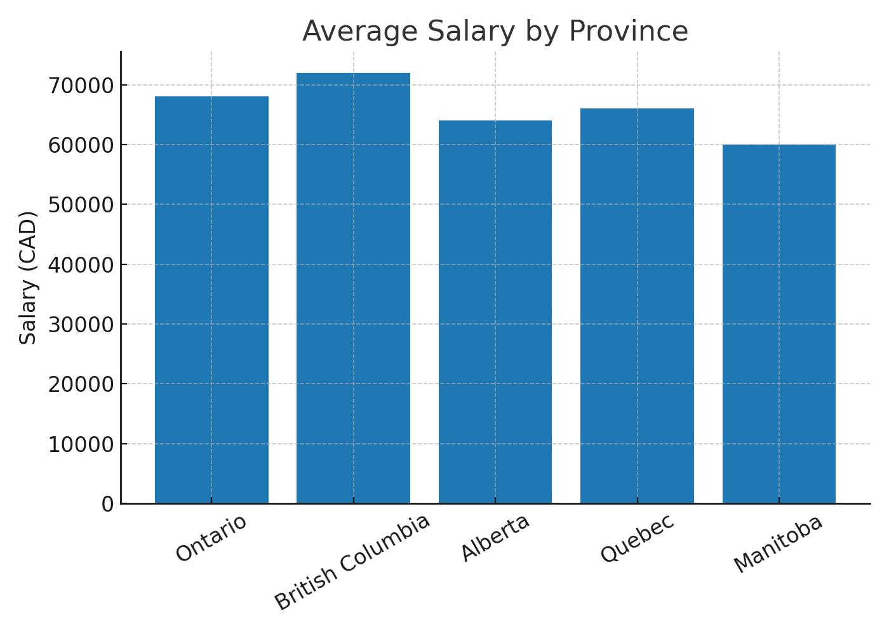
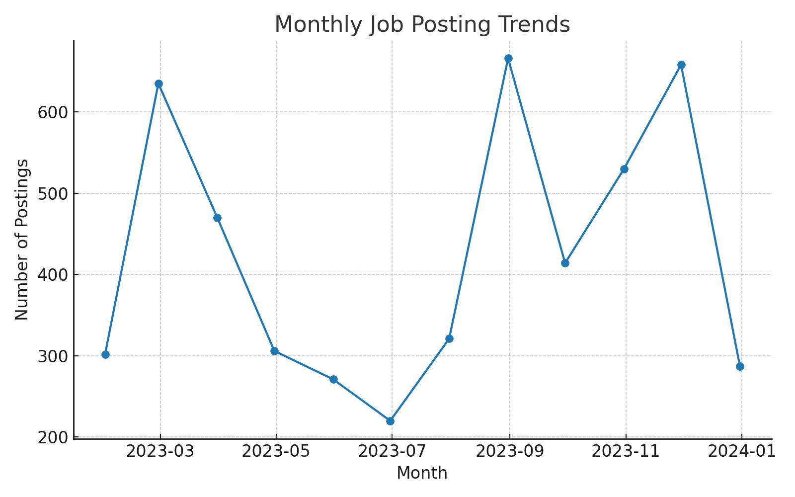

# Canada Job Market Trends (Python + ML)

This project analyzes a synthetic dataset of **2,000 Canadian job postings** using **Python**.  
It includes **data cleaning, EDA, visualizations, and a Machine Learning model** to predict salaries.

---

## 📂 Project Files
- `job_postings_canada_large.csv` → Dataset (2,000 rows)
- `job_trends_python_ml.ipynb` → Jupyter Notebook (EDA + ML)
- `job_trends_python_ml.py` → Python script version
- `job_trend_queries.sql` → Example SQL queries for analysis
- `avg_salary_by_province.png` → Visualization
- `monthly_trends.png` → Visualization

---

## 📊 Visualizations

### Average Salary by Province


### Monthly Job Posting Trends


---

## 🤖 Machine Learning (Salary Prediction)
A simple **Linear Regression** model is trained to predict salaries using:
- Province
- Job Title
- Month

**Example output:**  
```
R^2 score on test set: 0.72
Predicted salary for Ontario Data Analyst (2023-08): $65,400
Predicted salary for BC Data Scientist (2023-10): $82,100
```

---
## 🔑 Dashboard Pages

### Page 1: Overview
- KPI Cards: Total Jobs, Average Salary, Max Salary, Min Salary
- Map: Jobs by Province
- Bar Chart: Top 10 Job Titles by Count
- Line Chart: Jobs over Time

### Page 2: Salary Analysis
- Column Chart: Avg Salary by Province
- Line Chart: Avg Salary Trend by Month
- Table: Province, Job Title, Avg Salary

### Page 3: Trends & Forecast
- Line Chart: Job Count Trend with 6-month Forecast
- Clustered Bar Chart: Job Count by Province over Years

### Page 4: Drilldown / Interactive
- Slicers: Province, Job Title, Year
- Dynamic KPIs and visuals responding to selections

---

## 🔎 Key Insights
- Ontario and British Columbia have the highest job postings.
- Quebec reports the highest average salaries (~$81K).
- Data Analyst and Data Scientist remain top in-demand roles.
- Forecast suggests steady job posting growth for the next 6 months.

---

## 🚀 How to Use
1. Download the `.pbix` file and open in **Power BI Desktop**.
2. Use slicers to explore data by province, job title, and year.
3. View dynamic KPI changes and forecast trends.

---
## 🚀 How to Run
1. Install dependencies  
```bash
pip install -r requirements.txt
```

2. Run the Jupyter Notebook  
```bash
jupyter notebook job_trends_python_ml.ipynb
```

or execute the Python script directly:  
```bash
python job_trends_python_ml.py
```

---

## 🔮 Future Enhancements
- Add ARIMA/Prophet for time-series forecasting  
- Use Random Forest / XGBoost for salary classification  
- Build Power BI dashboard for business-friendly insights  

---

👤 Author: **Henish Modi**  
📌 [GitHub Portfolio](https://github.com/HenishModi)
